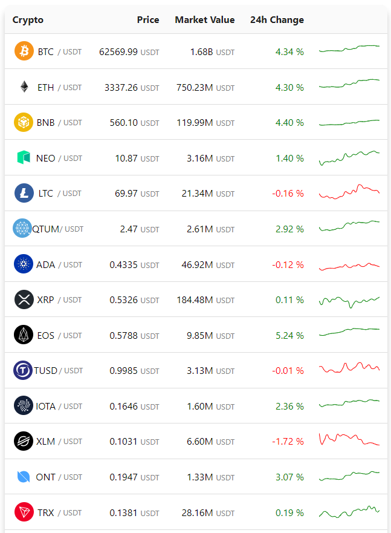

# Live Crypto Dashboard

## Introduction

This is project that is build for an assignment. It shows the inital crypto currency prices, market values, 24h changes and it's graphic on a table. The table is refreshed every 10 seconds.

## Installation

This is a React project that doesn't reuqire any backend setup since Binance APIs are used. In the project directory, you should run:

### `npm install`

To be able to install neccessary npm packages

### `npm start`

Runs the app in the development mode.\
Open [http://localhost:3000](http://localhost:3000) to view it in the browser.

The page will reload if you make edits.\
You will also see any lint errors in the console.

## Learn More

You can learn more in the [Create React App documentation](https://facebook.github.io/create-react-app/docs/getting-started).

To learn React, check out the [React documentation](https://reactjs.org/).
